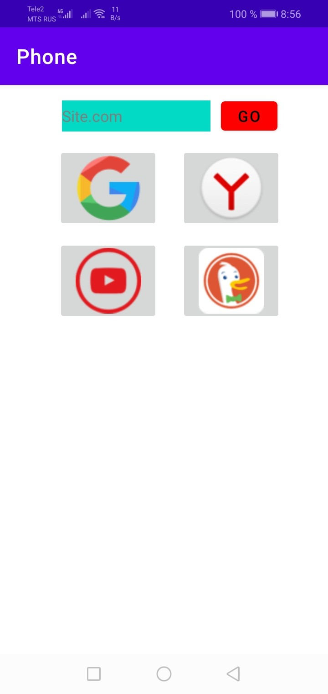
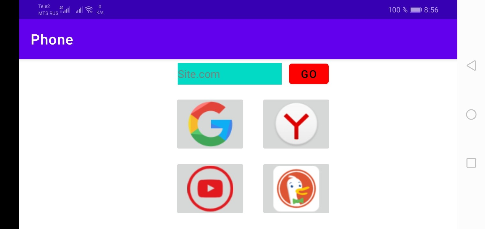

# Этот репозиторий предсталяет собой код приложения для Android с небольшим списком существующих браузеров.
Здесь ___Вы___ найдёте открытый исходный код приложения, которое было написано на языке __Java__ в редакторе кода __Android Studio__ на машине __Linux (Ubuntu).__
Это приложение доступно в __Google Play__, не собирает никаких данных о пользователях и не передаёт никакую информацию другим лицам.

__Скриншоты:__

